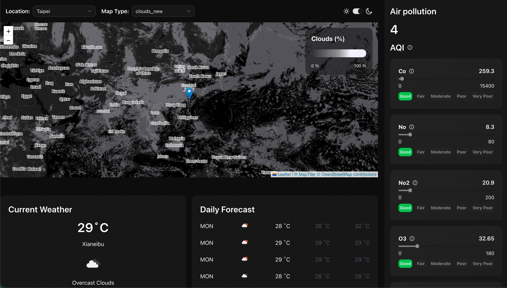
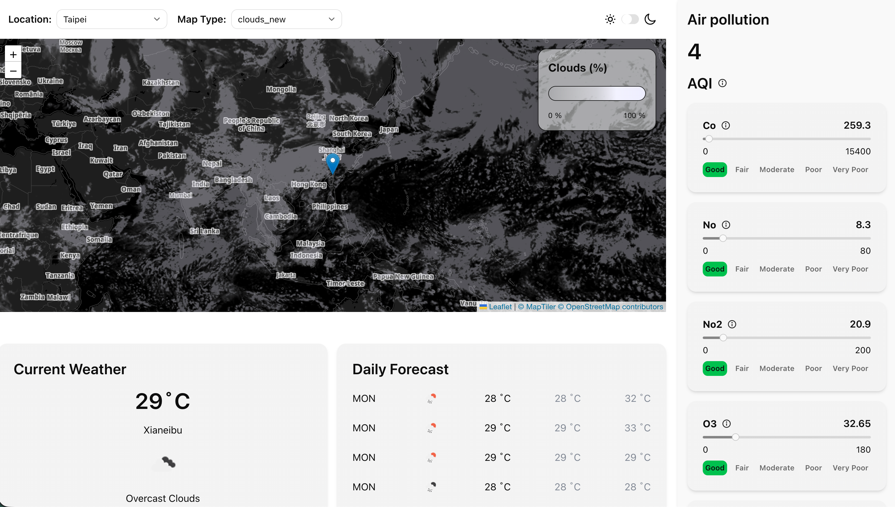

# Open Weather Project

This is a mini React + TypeScript project I built mostly without AI-assisted coding. I did, however, follow and learn a number of useful tips from [Austin Davis](https://www.youtube.com/watch?v=M-iV9R3kLNA).

## Table of contents

- [Overview](#overview)
  - [The challenge](#the-challenge)
  - [Screenshot](#screenshot)
  - [Links](#links)
- [My process](#my-process)
  - [Built with](#built-with)
  - [Continued development](#continued-development)
  - [What I learned](#what-i-learned)
  - [Useful resources](#useful-resources)
  - [AI Collaboration](#ai-collaboration)
- [Author](#author)
- [Acknowledgments](#acknowledgments)

## Overview

### The challenge

Users should be able to:

#### Map

- See the map with a marker pinned at the currently selected location.
- Click anywhere on the map to display weather data for that location when OpenWeather provides data for it.

#### Top dropdowns

- Change the city from the location dropdown and see the map update to the selected city.
- Change the map type from the map type dropdown and see the corresponding weather tile layer applied on top of the map.

#### Side panel

- View air pollution data with clear condition levels such as Good, Moderate, and Poor.
- Read extra information from tooltips for AQI and pollutant abbreviations.

#### General

- Use the dashboard comfortably across multiple screen sizes.
- Toggle between light and dark mode, with dark mode as the default theme.
- Hide the side panel on screens smaller than `1024px` and open it from the mobile header.

### Screenshot




### Links

- Solution URL: Not published yet
- Live Site URL: Not deployed yet

## My process

### Built with

- [React 19](https://react.dev/)
- [TypeScript](https://www.typescriptlang.org/)
- [Vite](https://vite.dev/) - project tooling and local development server
- [Tailwind CSS 4](https://tailwindcss.com/) - theme styling and layout
- [Shadcn/ui](https://ui.shadcn.com/) - components such as `Switch`, `Skeleton`, and some UI primitives
- [TanStack Query](https://tanstack.com/query/latest/docs/framework/react/installation#npm) - API fetching, caching, and loading states
- [Zod](https://zod.dev/) - API response validation
- [OpenWeather APIs](https://openweathermap.org/api/current?collection=current_forecast) - current weather, forecast, geocoding, weather map layers, and air pollution data
- [Postman](https://www.postman.com/) - API testing before wiring endpoints into the app
- [Vite Plugin SVGR](https://github.com/pd4d10/vite-plugin-svgr) - transforming SVG files into React components
- [Leaflet](https://leafletjs.com/) and [React Leaflet](https://react-leaflet.js.org/) - interactive map rendering
- [Vector Tiles in Leaflet](https://github.com/maptiler/leaflet-maptilersdk) - weather tile layers and map styling support

### Continued development

- Add a clearer empty or error state for locations where OpenWeather does not return data.
- Add search support to the location dropdown instead of only showing a fixed list of common cities.
- Improve the location search flow so the app can handle invalid or missing results more gracefully.

### What I learned

### 1. Type validation

From this project, I learned that data passed around the app should not be treated as `any`, because that can hide problems until runtime. API responses are especially risky because their structure may not always match what I expect.

The tool I used to solve this was [Zod](https://zod.dev/api). Zod is a TypeScript-first schema validation library that lets me validate runtime data and also infer useful types from the schema.

In this project, I took real OpenWeather API responses and used AI to speed up the initial schema-writing process. After that, I still had to adjust and verify the schemas myself based on the actual data returned by the app.

Before using Zod, `api.ts` would return JSON with the type `any`. After adding a schema, I could validate the response before using it in the UI.

```ts
// inside api.ts
const data = await res.json()
return weatherSchema.parse(data)
```

> 💡 My main takeaway was that schema validation helps catch bad assumptions early, especially when the data source is external.

[Reference](https://zod.dev/)

### 2. React Event Drilling

> Passing an event handler from a parent component to a child component through props.

I used event drilling in this project when a child component needed to trigger a state update that is owned by a parent component. A simple example is the map click flow: the `App` component owns the selected coordinates, then passes a callback down to the map so the map can update that state when the user clicks on a new location.

```tsx
const onMapClick = (lat: number, lng: number) => {
  setCoords({ lat, lng })
  setLocation("custom")
}

<Map coords={coords} onMapClick={onMapClick} mapType={mapType} />
```

What I learned here is that event drilling is completely fine when the component tree is still small and the relationship is clear. It only becomes a problem when too many layers need to pass the same props around.

> 💡 For a small project like this, passing handlers with props is simple and easier to understand than introducing extra global state too early.

[Reference](https://react.dev/learn/passing-props-to-a-component)

### 3. Concise ways to write JavaScript

#### 3.1 Format time

If I use `.toLocaleTimeString()` without any options, I get a value like `18:00:00`.

By passing formatting options, I can display the same time in a more user-friendly way, such as `6:00 PM`.

```ts
new Date(item.dt * 1000).toLocaleTimeString(undefined, {
  hour: "numeric",
  minute: "2-digit",
  hour12: true,
})
```

What I learned is that JavaScript already provides flexible date formatting tools, so I do not need a separate library for simple display formatting in a project like this.

> 💡 Native date formatting is often enough when the requirement is only presentation, not complex timezone calculations.

[Reference](https://developer.mozilla.org/en-US/docs/Web/JavaScript/Reference/Global_Objects/Date/toLocaleTimeString)

#### 3.2 Array looping: `Array.from()`

This is a concise functional way to create an array with a fixed number of repeated components.

```tsx
<div className="flex justify-between">
  {Array.from({ length: 5 }, (_, j) => {
    return <Skeleton key={j} className="w-8 h-6" />
  })}
</div>
```

Compared with what I used to write:

```tsx
const skeletons = []

for (let i = 0; i < 5; i++) {
  skeletons.push(<Skeleton key={i} className="w-8 h-6" />)
}

return <div>{skeletons}</div>
```

> 💡 `Array.from()` is concise, avoids an extra temporary variable, and fits naturally into JSX rendering.

[Reference](https://developer.mozilla.org/en-US/docs/Web/JavaScript/Reference/Global_Objects/Array/from)

#### 3.3 `Array.at()`

`Array.at()` is a modern way to access an element by index from an array or string.

I used it to access the `"Very Poor"` air quality level from the end of the array:

```ts
const veryPoorAirQualityLevels = airQualityLevels.at(-1)
```

Compared with what I used to write:

```ts
const veryPoorAirQualityLevels =
  airQualityLevels[airQualityLevels.length - 1]
```

> 💡 `Array.at()` makes code easier to read, especially when I want the last item with `-1`.

[Reference](https://developer.mozilla.org/en-US/docs/Web/JavaScript/Reference/Global_Objects/Array/at)

### 4. TanStack Query

TanStack Query was one of the most useful tools in this project because the app depends heavily on API data. I used it to fetch current weather, hourly forecast, daily forecast, geocoding, and air pollution data without manually handling every loading and caching case myself.

One important thing I learned is that the `queryKey` identifies cached data. If the key stays the same, TanStack Query can reuse the cached result instead of making an unnecessary request. If the response depends on a changing value such as coordinates or a city name, that value should be included in the key.

```ts
const { data } = useSuspenseQuery({
  queryKey: ["airpollution", coords],
  queryFn: () => getAirPollution(coords),
})
```

I also learned the difference between `useQuery` and `useSuspenseQuery`:

- `useQuery` is useful when I want to handle loading and error states directly inside the component.
- `useSuspenseQuery` works well when I already have a surrounding `<Suspense>` boundary and want to move loading UI into a fallback component such as a skeleton.

What I liked most is that TanStack Query reduced repeated fetch logic and made the data flow much clearer. Instead of manually managing `loading`, `error`, and `data` for every API call, I could focus more on rendering the UI correctly.

> 💡 My main takeaway was that TanStack Query is not only for fetching. Its real value is caching, deduplication, and making server-state handling more predictable.

[Reference](https://tanstack.com/query/latest/docs/framework/react/overview)

### 5. Using values from `.env` in Vite

Vite exposes built-in constants and environment variables through `import.meta.env`.

#### Built-in constants

```ts
import.meta.env.MODE     // "development" | "production"
import.meta.env.DEV      // true during development
import.meta.env.PROD     // true in production
import.meta.env.BASE_URL // base public path
```

For custom variables, Vite only exposes values prefixed with `VITE_` to client-side code. In this project, that is how I accessed the OpenWeather API key.

```ts
const API_KEY = import.meta.env.VITE_API_KEY
```

> 💡 According to [Vite](https://vite.dev/guide/env-and-mode#node-env-and-modes), variables prefixed with `VITE_` are exposed to the client bundle, so sensitive secrets should not be stored there.

[Reference](https://vite.dev/guide/env-and-mode)

### Useful resources

- [Austin Davis - Build a Weather App in React](https://www.youtube.com/watch?v=M-iV9R3kLNA) - This was the tutorial I followed for part of the project. It helped me understand the overall structure and API integration flow.
- [React Docs](https://react.dev/learn) - I used this when checking React patterns such as passing props, state updates, and component structure.
- [TanStack Query Docs](https://tanstack.com/query/latest/docs/framework/react/overview) - This helped me understand query keys, caching, and when `useSuspenseQuery` is a better fit.
- [Zod Docs](https://zod.dev/) - This was useful for validating API responses and understanding optional fields when real-world data did not match my first assumptions.
- [MDN Web Docs](https://developer.mozilla.org/) - I relied on MDN for smaller JavaScript details such as date formatting and array methods.
- [Vite Env and Mode Guide](https://vite.dev/guide/env-and-mode) - This clarified how `.env` variables work in a Vite project.

## AI Collaboration

Although I intentionally built this project without AI-assisted coding, I still used ChatGPT at a few points during development.

I found AI most useful when the task was repetitive or reference-based, rather than architectural. In this project, it helped me move faster without replacing the actual learning process.

### Examples of where I used AI

- Converting sample API responses into initial Zod schemas.
- Turning the OpenWeather Air Quality Index descriptions into TypeScript-friendly range data.
- Looking up the full names of pollutant abbreviations so I could explain them more clearly in tooltips.

## Author

- Metis Teng

## Acknowledgments

- [Austin Davis](https://www.youtube.com/watch?v=M-iV9R3kLNA) for the tutorial that helped shape the project structure.
- [OpenWeather](https://openweathermap.org/) for providing a free API tier that made this project possible.
